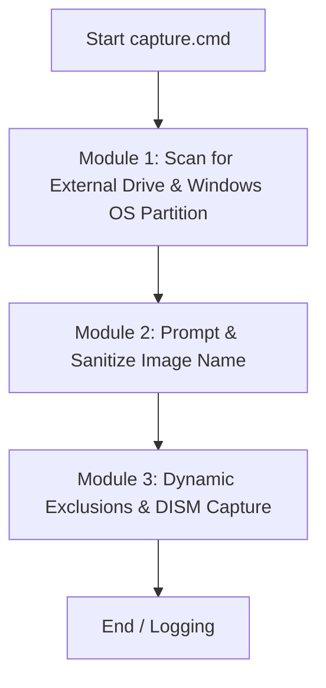

# Windows DISM Imaging Tools (WinPE)

A lightweight, automated, and robust script suite for capturing and deploying Windows partition images (`.wim`) using native Windows deployment tools (DISM, Diskpart, BCDBoot) within a Windows Preinstallation Environment (WinPE).

---

## Table of Contents
1. [Overview](#overview)
2. [Project Structure](#project-structure)
3. [Prerequisites & Requirements](#prerequisites--requirements)
4. [How It Works (Architectural Design)](#how-it-works-architectural-design)
    - [Capture Workflow (`capture.cmd`)](#capture-workflow-capturecmd)
    - [Deploy Workflow (`deploy.cmd`)](#deploy-workflow-deploycmd)
5. [Usage Guide](#usage-guide)
    - [1. USB Drive Setup](#1-usb-drive-setup)
    - [2. Capturing a Windows Image](#2-capturing-a-windows-image)
    - [3. Deploying a Windows Image](#3-deploying-a-windows-image)
6. [Advanced Customization](#advanced-customization)
    - [Modifying Exclusions](#modifying-exclusions)
    - [Altering Partition Schemes](#altering-partition-schemes)
7. [Troubleshooting & Logs](#troubleshooting--logs)

---

## Overview

This toolset simplifies and automates the creation and deployment of system backups. Instead of relying on heavy third-party software, it leverages Microsoft's official APIs and command-line utilities.

It is designed to run inside **WinPE** to ensure that:
* The system partition is captured in a clean, offline state, avoiding locking conflicts (using `capture.cmd`).
* The target disk can be fully wiped, partitioned for UEFI/GPT, and restored dynamically (using `deploy.cmd`).

---

## Project Structure

* **`capture.cmd`**: Captures a selected Windows partition on the host computer and packages it into a compressed `.wim` image stored on an external drive. It dynamically excludes user OneDrive directories to prevent capture failures caused by cloud-only placeholder files (reparse points).
* **`deploy.cmd`**: Formats the target drive (Disk 0) as GPT, configures boot and primary partitions, applies a selected `.wim` file, and establishes the UEFI bootloader.

---

## Prerequisites & Requirements

1. **Windows PE Bootable Media**: A USB drive configured with WinPE (v5.0 or newer).
2. **External Storage Setup**:
   * A partition labeled **`IMAGENES`** (used by `capture.cmd` to dynamically detect the backup drive).
   * A root directory named **`WIM`** on that partition (used by `deploy.cmd` to search and index WIM files).
   * *Note*: These are default values defined as variables at the top of the scripts (`EXT_LABEL` / `EXT_DIR` in `capture.cmd` and `IMGDIR` in `deploy.cmd`) and can be customized.
3. **Target Machine Hardware**:
   * UEFI-compatible BIOS (CSM disabled is recommended).
   * Target drive for installation (configured via the `TARGET_DISK` variable in `deploy.cmd`, defaulting to `0`).

---

## How It Works (Architectural Design)

### Capture Workflow (`capture.cmd`)

The script automates the backup process through 3 modules:



1. **Unified Drive and OS Detection**: Scans all active drive letters (`C:` to `Z:`, statically excluding the WinPE drive `X:`) in a single fast loop using the native `vol` command. It identifies the external drive (by matching its label with `EXT_LABEL`) and the Windows OS partition (by checking for `Windows\System32\config\SYSTEM` and `Users`).
2. **Input Validation**: Prompts the user for a base name and validates that it is not empty.
3. **Dynamic Exclusions & DISM Capture**: Generates a temporary `exclude.ini` file. Since using a custom `/ConfigFile` overrides DISM's built-in default exclusions, the script manually writes the default system exclusions (like `pagefile.sys`, `hiberfil.sys`, etc.) first. Then, it dynamically appends user-specific OneDrive sync folders (excluding their contents `\*` to prevent DISM from failing on non-local cloud-only placeholders, while keeping the folder structure itself to avoid broken explorer sidebar links), executes the native `Dism /Capture-Image` tool.

---

### Deploy Workflow (`deploy.cmd`)

The restoration script operates as follows:

1. **WIM Discovery**: Scans the designated `WIM` folder on the script's drive and populates a dynamic index.
2. **Menu Selection & Safety Check**: Renders a menu of available images. After selection, it warns the user and requires explicit confirmation (`S/N`) to prevent accidental formatting.
3. **Disk Preparation**: Creates a temporary Diskpart script that selects the target disk (defined by the `TARGET_DISK` variable at the top of the script, defaulting to `0`), wipes it clean, converts it to GPT format, creates a 200MB EFI system partition, a 16MB MSR partition, and formats the primary partition.
4. **WIM Application**: Applies the selected image to the primary partition using `Dism /Apply-Image` with integrity verification (`/CheckIntegrity`).
5. **UEFI Boot Setup**: Configures the UEFI boot files on the EFI partition pointing to the new Windows directory using `bcdboot`.

---

## Usage Guide

### 1. USB Drive Setup
* Formatted partition label: `IMAGENES`
* Directory structure:
  ```text
  <USB_DRIVE>/
  ├── WIM/
  │   └── (your .wim images go here)
  ├── Logs/
  │   └── (automatically generated logs)
  ├── capture.cmd
  └── deploy.cmd
  ```

### 2. Capturing a Windows Image
1. Boot the target machine into **WinPE**.
2. Connect your external USB drive labeled `IMAGENES`.
3. Open the command prompt in WinPE and run the capture script:
   ```cmd
   cd /d <PATH_TO_USB_DRIVE>
   capture.cmd
   ```
4. Enter the base name when prompted (e.g., `Windows11_Base`).
5. Wait for DISM to complete the capture. The image will be saved inside the `WIM` folder as `Windows11_Base_YYYYMMDD_HHMM.wim`.

### 3. Deploying a Windows Image
> [!CAUTION]
> This process is destructive and will completely wipe **Disk 0** of the target machine.

1. Boot the target machine into **WinPE**.
2. Run the deployment script from the USB drive:
   ```cmd
   cd /d <PATH_TO_USB_DRIVE>
   deploy.cmd
   ```
3. A menu will appear showing the available images in the `WIM` folder. Select the desired option number.
4. Confirm the operation and wait for Diskpart, DISM, and BCDBoot to complete.
5. Once completed successfully, reboot the machine.

---

## Advanced Customization

### Modifying Exclusions
If you want to exclude additional directories during the capture phase, modify the dynamic file generation section in `capture.cmd`. Since specifying a custom `/ConfigFile` disables DISM's default exclusion list, `capture.cmd` manually writes them first. You can add more static exclusions to the generated `exclude.ini`:

```cmd
(
echo [ExclusionList]
echo \$ntfs.log
echo \hiberfil.sys
echo \pagefile.sys
echo \swapfile.sys
echo \System Volume Information
echo \RECYCLER
echo \Windows\CSC
echo \Windows\Temp\*
REM ... OneDrive dynamic exclusions ...
) > "%TEMP%\exclude.ini"
```

### Altering Partition Schemes
To customize the partition layout during deployment (e.g., adding a Recovery partition or increasing the EFI partition size), edit the Diskpart script block inside `deploy.cmd` (lines 90-102):

```cmd
(
  echo select disk 0
  echo clean
  echo convert gpt
  echo create partition efi size=500
  echo format quick fs=fat32 label="SYSTEM"
  ...
) > "%DP_TEMP%"
```

---

## Troubleshooting & Logs

All actions are audited to allow easy post-mortem debug.

* **Capture logs**: Saved on the external drive under `Logs\Backup_YYYYMMDD_HHMM.log` or inside the designated `Logs` directory.
* **Deployment logs**: Saved as `Logs\deploy_YYYYMMDD_HHMMSS.log` on the USB drive. This log contains stdout and stderr output from Diskpart, DISM, and BCDBoot execution.
* If DISM throws an error (e.g., exit code `87` or `11`), check the log file to ensure that the source partition was not corrupted, or if it was encrypted with BitLocker.
